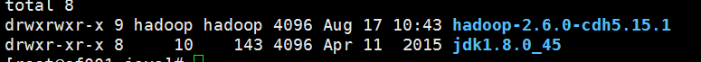

## hadoop集群作业
1.Hadoop集群部署
2.Hadoop部署文档 书写word或md
3.hdfs yarn常用命令整理
4.整理故障案例
5.预习 压缩哪几种，编译后的 执行 hadoop checknative 命令 输出结果是什么？
6.ruozedata002 standby节点机器上，
能不能直接读 hdfs dfs -ls hdfs://ruozedata002:8020/ ？
能不能直接写 hdfs dfs -put xxx.log hdfs://ruozedata002:8020/ ?
7.什么是hdfs的安全模式？如何进，如何离开？
那么在安全模式下，能读文件吗 ？能写文件吗？
8.hdfs ha启动过程中，那么多进程，先后顺序关系是什么? dn进程是最后启动吗？

## hadoop集群学习总结
### 部署阿里云
云服务器ECS-创建实例-深圳-按量付费-2CPU8G
自定义密码
登录名 root Shenzhen12121
实例名称  david 主机名 sf

创建hadoop用户
useradd hadoop
su hadoop
mkdir app software source data lib script tmp maven_repos
which rz命令查看是否有rz工具
[hadoop@sf002 ~]$ which rz
/usr/bin/which: no rz in (/usr/local/sbin:/usr/local/bin:/usr/sbin:/usr/bin:/root/bin)
没有的话退回到root用户(hadoop用户没有权限)，yum下载rz工具 yum install -y lrzsz
[root@sf001 ~]# which rz
/usr/bin/rz

G哥-20190818
### 课程回顾
大多数据公司的环境都是cdh，而里面默认的命名就是nameseverice

### 集群环境部署
1、阿里云按量付费三台机器
云服务器-ECS-创建实例-上海区域-cpu2 8g entos 7.2 默认交换机，固定带宽5m 自定义密码 有序后缀，申请三台机器，具体参照专门文档操作，注意：在停机后公网ip被回收，再次打开需要重新连接
2、使用xshell连接机器
使用xshell连接机器，注意，没有安装的可以再官网申请免费版本，免费下载链接会发送到个人邮件，操作xshell可以使用三台机器同时操作：工具》发送键输入到所有会话。
3、创建用户、文件夹，并上传文件包
useradd hadoop
su - hadoop
mkdir app data lib maven_repos source scrippt tmp
which rz #上传文件使用的
没有rz的话exit退回到root用户(hadoop用户没有权限)，yum下载rz工具 
yum install -y lrzsz 
rz 上传
sz filename 下载
10M/8 贷款除以8为传输速度
准备三个安装包来，pdf只是提供思路，不要看pdf的版本
不做伸手党
#### 配置hosts
vm虚拟机需要从第5步开始做
部署机器的时候，每台机器的ip需要是静态地址

不要删掉
配置hostname，三台机器一起做
阿里云只需要从第五步骤做的额，不过有些步骤阿里云已经做好了就不需要做了，vm前面的是需要做的
静态ip-阿里做好了
防火墙阿里云默认关闭，web端可以操作
配置host的ip地址，注意 etc/host中配置的是内网ip ，host中的第一行和第二行不要删掉
使用root账号，三台一起
vi /etc/hosts
172.18.24.157 sf001
172.18.24.158 sf002
172.18.24.156 sf003

停机不收费说明
您正在对专有网络（VPC）内按量付费ECS实例执行“停止”操作，对此次停止的按量付费实例：

停止实例后实例计算资源将不再计费（实例的CPU和内存将不再保留），云盘（包括系统盘、数据盘）、弹性公网IP和带宽仍旧收费，公网IP将被回收（弹性公网IP仍旧保留），私网IP将保留；
因为实例的CPU和内存不做保留，您再次启动处于停止状态（Stopped）实例时，有可能启动失败，您可以尝试再次启动；
重新启动实例后，公网IP将重新分配，弹性公网IP仍旧使用停止前的IP地址（除非启动前做了解绑操作）。
#### 配置ssh三台机器互信
家目录下 ssh -keygen 回车，三台一起操作
hadoop node设置
http://hadoop.apache.org/docs/stable/hadoop-project-dist/hadoop-common/SingleCluster.html
```
 $ ssh-keygen -t rsa -P '' -f ~/.ssh/id_rsa
  $ cat ~/.ssh/id_rsa.pub >> ~/.ssh/authorized_keys
  $ chmod 0600 ~/.ssh/authorized_keys
```
选取第一台作为主节点
----配置互相信任关系
绕过密码
把一台的公钥内容保存到认证的key文件中（追加自动形成）
把第二、三台机器的公钥拷贝到第一台的.ssh中，并且把后两台的公钥中的内容追加到第一台的authorized_keys中，并且把改文件复制到第二、三台中去
追加模式，把2 3的公钥内容追加到1的认证key文件里面
cat id_rsa.pub2 >> authorized_keys
cat id_rsa.pub3 >> authorized_keys

将认证文件下载到桌面，然后rz上传到第二台和第三台，直接下载文件下载上传过去，复制可能产生换行或者特殊符号，避免采坑
更改authorized_keys的权限 chmod 600 authorized_keys，注意：权限比这个高都不行
ssh sf001 date 
ssh sf002 date 
ssh sf003 date
链接sf002并且显示日期，查看是否可以相通了

登录的时候第一次需要需要yes，会保存known_hosts文件，以后就不需要输入了
如果ssh是重新生成的，则需要把know_hosts删除重新ssh连接


## 部署jdk，三台机器一块做,必须部署在root 账号的 /usr/java中
hadoop账号先分发软件包，已经配置好了信任关系，scp命令即可，内网传输很快的，然后操作的时候三台机器一起
scp root@10.119.72.206:/app/aoi_project/aoi_query_address_data/result_aoi/*  /app/aoi/aoi_tc_update/data/20190716/aoi_shape/
scp * sf002:/home/hadoop/software/
scp * sf003:/home/hadoop/software/

切换root账号
创建文件夹 
mkdir /usr/java
解压缩安装包到指定目录,-C 表示解压到某个目录下面
tar -zxvf /home/hadoop/software/jdk-8u45-linux-x64.gz -C /usr/java
全局的环境变量 vi /etc/profile
export JAVA_HOME=/usr/java/jdk1.8.0_45
export PATH=$JAVA_HOME/bin:$PATH
追加到path前面，然后source生效
source /etc/profile  
which java 查看java是否安装了
坑：修正java权限，由于解压使用的是临时用户组，所以要更改用户和用户组

chown -R root:root /usr/java/*

软连接还是很重要的
一个箭头，表示覆盖 和生成
### 部署zookeeper
 su hadoop
tar -zxvf hadoop-2.6.0-cdh5.15.1.tar.gz -C ~/app/
tar -zxvf zookeeper-3.4.6.tar.gz -C ~/app/

使用软链接，如果版本号变更在，相关的配置信息里就不需要修改
ln -s zookeeper-3.4.6 zookeeper
ln -s hadoop-2.6.0-cdh5.15.1 hadoop
修改zookeeper配置
cd zookeeper/conf
cp zoo_sample.cfg zoo.cfg
vi zoo.cfg
dataDir= /home/hadoop/data/zookeeper

server.1=sf001:2888:3888
server.2=sf002:2888:3888
server.3=sf003:2888:3888

标识机器，分开操作，追加箭头前后有空格
mkdir data
echo 1 > /home/hadoop/data/zookeeper/myid
echo 2 > /home/hadoop/data/zookeeper/myid
echo 3 > /home/hadoop/data/zookeeper/myid

配置环境变量，jdk是全局的，zookeeper是hadoop用户下面的，因此使用个人的环境变量
vi ~/.bash_profile或者vi  ~/.bashrc
删掉这两行


export ZOOKEEPER_HOME=/home/hadoop/app/zookeeper
export PATH=$ZOOKEEPER_HOME/bin:$PATH

source ~/.bash_profile 生效 
which zkServer.sh 查看
~/app/zookeeper/bin/zkServer.sh 表示操作成功
zkServer.sh start 启动
zkServer.sh status查看启动状态
启动成功会展示 Mode:foller/leader

zookeeper启动报错：Error contacting service. It is probably not running.
查看日志  zookeeper.out 
可能原因：
文件路径错了
1、防火墙
centos6
service iptables status
 service iptables start
service iptables stop
centos7
systemctl stop firewalld.service #停止firewall
systemctl disable firewalld.service #禁止firewall开机启动
firewall-cmd --state #查看默认防火墙状态（关闭后显示notrunning，开启后显示running）
2、data目录下myid文件中的数字和zoo.cfg的不对应
3、端口被占用查看端口 netstat -lntup,更改端口为2889

zk启动后是正常的，有可能隔几秒，崩掉
zk存放一些信息
nn rn
dn rn
配置nameservice 
chmod -R

zookeeper的端口是，默认是2181

### 配置hadoop的配置 文件
 /home/hadoop/app/hadoop/etc/hadoop/

 修改 /home/hadoop/app/hadoop/etc/hadoop/hadoop-env.sh

/usr/java/jdk1.8.0_45
修改xml文件
rm -f core-site.xml hdfs-site.xml slaves yarn-site.xml mapred-site.xml
core-site.xml
mkdir -p /home/hadoop/tmp/hadoop #创建临时目录
chmod 777 hadoop
zookeeper的对外端口号是2181

hdfs-site.xml
mkdir -p /home/hadoop/data/dfs/name
mkdir -p /home/hadoop/data/dfs/jn
mkdir -p /home/hadoop/data/dfs/jn

大数据压缩的几种方法
map端输出的结果，到reduce端是需要做suffer的，是落到磁盘上的，为什么map做完了，out的时候是选择snappy压缩？压缩和解压快

yarn-xite.xml

聚合日志


分发这几个文件
scp *.xml slaves sf002:/home/hadoop/app/hadoop/etc/hadoop/
scp *.xml slaves sf003:/home/hadoop/app/hadoop/etc/hadoop/

### 启动集群
#### 检查zookeeper状态
which zkServer.sh
zkServer.sh status/zkServer.sh start/zkServer.sh stop
配置HADOOP_HOME的环境变量
vi ~./bash_profile
export HADOOP_HOME=/home/hadoop/app/hadoop
export PATH=$HADOOP_HOME/bin:$HADOOP_HOME/sbin:$PATH
source ~/.bash_profile 市环境变量生效
which hdfs查看是否生效
hadoop中有个bin和sbin，区别会什么？

#### 启动JournalNode进程
hadoop-daemon.sh start journalnode

jps查看是否生效

#### 格式化NameNode
选择其中一台，不能批量做了
hadoop namenode -format
有succssful即表示成功

同步NameNode到2 3
scp -r /home/hadoop/data/dfs/name sf002:/home/hadoop/data/dfs/

#### 初始化zkfc
为什么没有datanode
看liunx文件的类型，两种，一种是windows上传的，一种是liunx的


没有这个命令，yum源安装下


ASCII编码可以，UTF8也可以
集群如何启动

yarn
jobhistory历史状态的查看
start-all.sh 等价于 hdfs和yarn

### hdfs的高级命令
失效转移failover


做失效检查


balance数据平衡


### 块文件丢失怎么处理


直接删除的这些文件，而不是block快，一个文件对应几个块，块分布在哪台机器

两种方法
一种直接数据重刷 hbase数据有就会update，没有就insert
一种是找到损坏的块，删除该副本的该快，然后再修复该块hdfs debug，手工修复
block块的路径 怎么找

hdfs上传文件


不要等到问题出现了才解决，可以多模拟出现问题出现的情况，然后找到解决办法

针对的是好的文件，坏的文件看不出来，不显示的
若泽公司，1万多节点，每秒200G的数据


