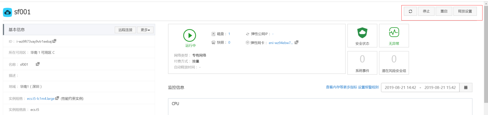

### 基础配置
计费方式：按量付费。特别注意：不用时候需要选停机不收费。
地域：所在地域
实例：2核8G，突发性能实例t5，仅供个人测试使用，不稳定且没有保障不适用商业。
镜像：Centos 7.2 64位

`

### 网络和安全组：
各个参数都选择默认的就行了。
注：如果对带宽要求比较高，可以再使用过程中动态调整实例带宽，限制5分钟调整一次。

### 系统配置
登录凭证：自定义密码
登录名：root
设置密码、实例名称、主机名，勾选有序后缀

### 分组设置
全部默认就可以了

### 确定订单

### 创建实例

创建实例成功，自动启动运行

### 更改网络带宽

### 停机和释放
#### 注意，选择停止》停机不收费该项，只需收费少量的存储费用，不然每天要花很多钱。

释放：释放后实例被回收，所有的资源和数据消失且不可恢复。

